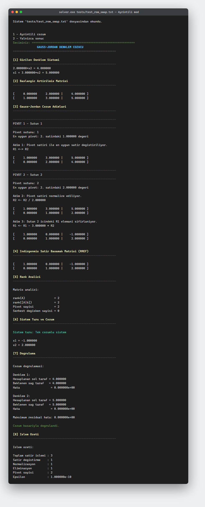
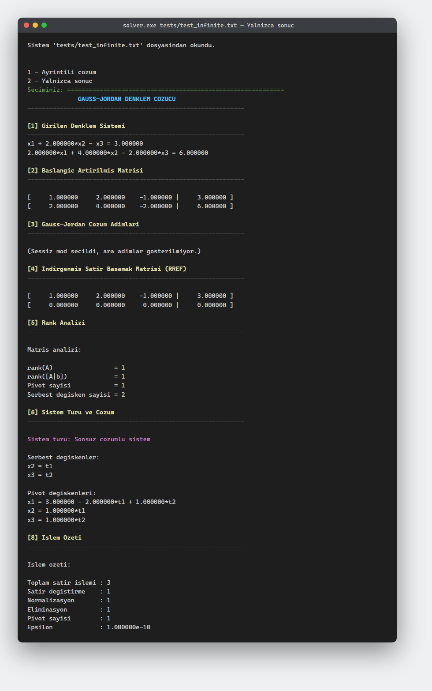
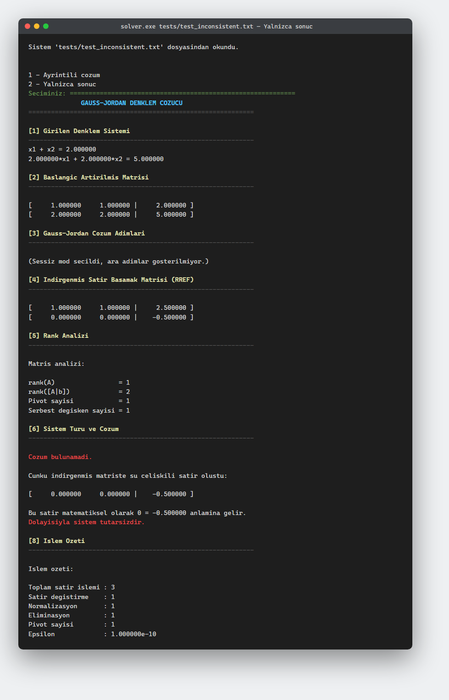

# Gauss-Jordan Doğrusal Denklem Çözücü

*Diğer diller: [English](README.en.md)*

Saf C (C11) ile yazılmış, harici kütüphane kullanmayan, eğitim amaçlı bir
doğrusal denklem sistemi çözücüsü. Kullanıcının girdiği sistemi
Gauss-Jordan eliminasyonu (partial pivoting ile) kullanarak indirgenmiş
satır basamak biçimine (RREF) dönüştürür ve bu süreçteki her satır
işlemini adım adım açıklar.

## Amaç

Program yalnızca bir sonuç hesaplamaz; matematiksel çözüm sürecinin
tamamını (pivot seçimi, satır değiştirme, normalizasyon, eliminasyon)
görünür kılar, sistemin türünü (tek çözümlü / sonsuz çözümlü /
çözümsüz) belirler, sonsuz çözümlü sistemlerde parametrik çözümü
üretir ve tek çözümlü sistemlerde bulunan çözümü orijinal denklemlerde
yerine koyarak doğrular.

## Gauss-Jordan Yöntemi (Kısaca)

Gauss-Jordan eliminasyonu, bir artırılmış matris `[A|b]` üzerinde şu
adımları tekrarlayarak matrisi RREF biçimine getirir:

1. İşlenen sütunda (soldan sağa) mutlak değeri en büyük satır pivot
   olarak seçilir (partial pivoting).
2. Gerekirse pivot satırı, işlem yapılan satırla değiştirilir.
3. Pivot satırı, pivot eleman 1 olacak şekilde normalize edilir.
4. Pivot sütunundaki diğer tüm satırlardan (üst ve alt) pivot satırının
   uygun katı çıkarılarak o sütun sıfırlanır.
5. Bir sonraki satır/sütuna geçilir; uygun pivot bulunamayan sütunlar
   serbest değişken sütunu olarak işaretlenir.

İşlem tamamlandığında `rank(A)` ve `rank([A|b])` karşılaştırılarak
sistemin tek çözümlü, sonsuz çözümlü veya çözümsüz olduğu belirlenir.

## Özellikler

- Kare, dikdörtgen (fazla/eksik denklemli), sıfır/negatif/ondalıklı
  katsayılı sistemleri destekler.
- Partial pivoting ile sayısal kararlılık.
- Her satır işleminin (`R_i <-> R_j`, `R_i <- R_i / c`,
  `R_i <- R_i + c * R_j`) ve o işlemden sonraki matrisin gösterilmesi.
- Ayrıntılı mod ve yalnızca-sonuç modu.
- Rank hesabı, pivot/serbest değişken tespiti.
- Sonsuz çözümlü sistemlerde dinamik olarak üretilen parametrik çözüm
  (`t1`, `t2`, ...).
- Çözümsüz sistemlerde çelişkili satırın (`0 = c`) gösterilmesi.
- Tek çözümlü sistemlerde çözümün orijinal denklemlerde yerine
  konularak doğrulanması ve residual hata hesabı.
- İşlem istatistikleri (satır değiştirme, normalizasyon, eliminasyon
  sayıları, epsilon değeri).
- Klavyeden veya dosyadan giriş; komut satırından dosya adı desteği.
- Çözüm raporunun `solution_report.txt` (veya seçilen ad) dosyasına
  kaydedilmesi.
- `fgets` + `strtod`/`strtol` tabanlı güvenli girdi okuma; geçersiz
  girdilerde program çökmez, yeniden sorar.
- Güvenli dinamik bellek yönetimi: her ayırma kontrol edilir, program
  sonunda tüm bellek serbest bırakılır.

## Proje Klasör Yapısı

```text
linear_solver/
|-- include/       Baslik dosyalari (matrix.h, gauss_jordan.h, ...)
|-- src/            Kaynak dosyalari (main.c, matrix.c, ...)
|-- tests/          Test sistemleri (.txt)
|-- examples/       Ornek sistemler
|-- docs/           Ekran goruntuleri (README icin)
|-- Makefile
|-- README.md
`-- README.en.md
```

Modüller:

| Modül            | Sorumluluk                                              |
|-------------------|----------------------------------------------------------|
| `matrix`          | Dinamik matris veri yapısı ve temel satır işlemleri       |
| `parser`          | Güvenli sayı ayrıştırma (`fgets` + `strtod`/`strtol`)      |
| `input`           | Klavye/dosya girişi, doğrulama, menüler                  |
| `gauss_jordan`    | Partial pivoting ile Gauss-Jordan eliminasyonu, RREF      |
| `solution`        | Pivot/serbest değişken tespiti, parametrik çözüm üretimi  |
| `verification`    | Çözümün orijinal sistemde doğrulanması, residual hata     |
| `output`          | Ortak `FILE *` tabanlı terminal/dosya çıktı fonksiyonları  |
| `main`            | Orkestrasyon: akışın baştan sona yönetimi                 |

## Derleme

Gereksinim: `gcc` (C11 destekli) ve `make` (Windows'ta `mingw32-make`).

```bash
make
```

Release (optimize edilmiş) derleme:

```bash
make release
```

Çalıştırma:

```bash
make run
```

Testleri çalıştırma:

```bash
make test
```

Temizlik:

```bash
make clean
```

Windows üzerinde MinGW ile doğrudan derleme:

```bash
gcc -std=c11 -D__USE_MINGW_ANSI_STDIO=1 -Wall -Wextra -Wpedantic -Wconversion -Wshadow -Iinclude -o solver.exe src/*.c
```

> Not: MinGW'nin eski `printf` uygulaması `%zu` gibi C11 boyut
> belirteçlerini desteklemediğinden `-D__USE_MINGW_ANSI_STDIO=1`
> bayrağı kullanılır. Linux/macOS derlemelerinde bu bayrak gerekmez
> (Makefile bunu otomatik algılar).

## Kullanım Örnekleri

### Klavyeden giriş

```bash
./solver
```

```text
1 - Klavyeden giris
2 - Dosyadan giris
Seciminiz: 1
Denklem sayisi: 3
Degisken sayisi: 3

1. denklemin katsayilarini girin:
x1: 2
x2: 1
x3: -1
Sabit terim: 8
...
```

### Dosyadan giriş (komut satırı)

```bash
./solver tests/test_unique.txt
```

### Dosyadan giriş (menüden)

```text
1 - Klavyeden giris
2 - Dosyadan giris
Seciminiz: 2
Dosya adi: tests/test_unique.txt
```

## Ekran Görüntüleri

**Ayrıntılı mod — tek çözümlü sistem, satır değiştirme dahil (`tests/test_row_swap.txt`)**



**Yalnızca-sonuç modu — sonsuz çözümlü sistem, parametrik çözüm (`tests/test_infinite.txt`)**



**Yalnızca-sonuç modu — çözümsüz (tutarsız) sistem (`tests/test_inconsistent.txt`)**



## Dosya Giriş Formatı

```text
denklem_sayisi degisken_sayisi
katsayi_1 katsayi_2 ... katsayi_n sabit_terim
...
```

Örnek (`tests/test_unique.txt`):

```text
3 3
2 1 -1 8
-3 -1 2 -11
-2 1 2 -3
```

## Tek Çözüm Örneği

Girdi: `tests/test_unique.txt` → Çıktı:

```text
Sistem turu: Tek cozumlu sistem

x1 = 2.000000
x2 = 3.000000
x3 = -1.000000
```

## Sonsuz Çözüm Örneği

Girdi: `tests/test_infinite.txt` (2 denklem, 3 değişken, ikinci denklem
birincinin iki katı) → Çıktı:

```text
Sistem turu: Sonsuz cozumlu sistem

Serbest degiskenler:
x2 = t1
x3 = t2

Pivot degiskenleri:
x1 = 3.000000 - 2.000000*t1 + 1.000000*t2
x2 = 1.000000*t1
x3 = 1.000000*t2
```

## Çözümsüz Sistem Örneği

Girdi: `tests/test_inconsistent.txt` → Çıktı:

```text
Cozum bulunamadi.

Cunku indirgenmis matriste su celiskili satir olustu:

[     0.000000     0.000000 |    -0.500000 ]

Bu satir matematiksel olarak 0 = -0.500000 anlamina gelir.
Dolayisiyla sistem tutarsizdir.
```

(Bu satirin sabit degeri, secilen pivotlara bagli olarak farkli bir
sifirdan-farkli deger olabilir; onemli olan katsayilarin tumunun sifir,
sabit terimin ise sifirdan farkli olmasidir.)

## Sayısal Hassasiyet Açıklaması

Program hiçbir yerde `değer == 0.0` karşılaştırması yapmaz. Bunun
yerine `config.h` içinde tanımlı `DEFAULT_EPSILON` (`1e-10`) kullanılır:
bir değer `fabs(value) < epsilon` ise sıfır kabul edilir. Pivot seçiminde
her zaman mevcut sütunda mutlak değeri en büyük satır seçilir (partial
pivoting), bu da yuvarlama hatalarını azaltır. Bir pivotun mutlak
değeri `NEAR_SINGULAR_THRESHOLD` (`1e-6`) altındaysa (ama epsilon
üzerindeyse) program "sistem sayısal olarak kararsız olabilir"
uyarısı verir. Ekrana yazdırılan tüm değerlerde `-0.000000` gibi
negatif sıfırlar `0.000000` olarak gösterilir.

## Testlerin Çalıştırılması

`tests/` klasöründeki sistemler `make test` ile otomatik çalıştırılır;
her biri sırasıyla:

- `test_unique.txt` — tek çözümlü kare sistem
- `test_row_swap.txt` — satır değiştirme gerektiren sistem
- `test_infinite.txt` — sonsuz çözümlü sistem
- `test_inconsistent.txt` — çözümsüz sistem
- `test_rectangular.txt` — denklem sayısı fazla, tutarlı sistem
- `test_decimal.txt` — ondalıklı katsayılar
- `test_underdetermined.txt` — değişken sayısı fazla sistem
- `test_near_singular.txt` — neredeyse tekil sistem

Tek bir sistemi manuel çalıştırmak için:

```bash
./solver tests/test_infinite.txt
```

## Bilinen Sınırlamalar

- Çok büyük sistemlerde (`MAX_EQUATION_COUNT` / `MAX_VARIABLE_COUNT`,
  varsayılan 1000) girdi reddedilir; bu, taşmayı ve aşırı bellek
  kullanımını önlemek içindir.
- Program tek hassasiyetli değil `double` kullanır; aşırı büyük/küçük
  katsayı farklarına sahip son derece kötü koşullu (ill-conditioned)
  sistemlerde residual hata epsilon sınırını aşabilir (bu durum
  doğrulama adımında raporlanır).
- Kesirli (rational) aritmetik desteklenmez; tüm hesaplamalar `double`
  ile yapılır.

## Gelecekte Eklenebilecek Özellikler

- Gaussian elimination (yalnızca REF), LU ayrıştırma
- Determinant ve matris tersi hesabı
- Homojen sistem çözümü, null space / satır-sütun uzayı
- Cramer, Jacobi, Gauss-Seidel yöntemleri
- Kesirli aritmetik veya çok hassas aritmetik modu
- Çözüm adımlarını ileri/geri oynatma
- Grafik kullanıcı arayüzü veya HTML/SVG rapor çıktısı
